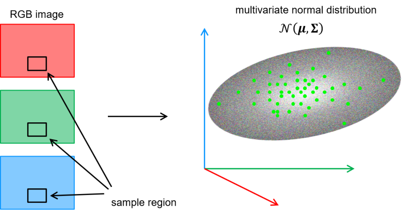
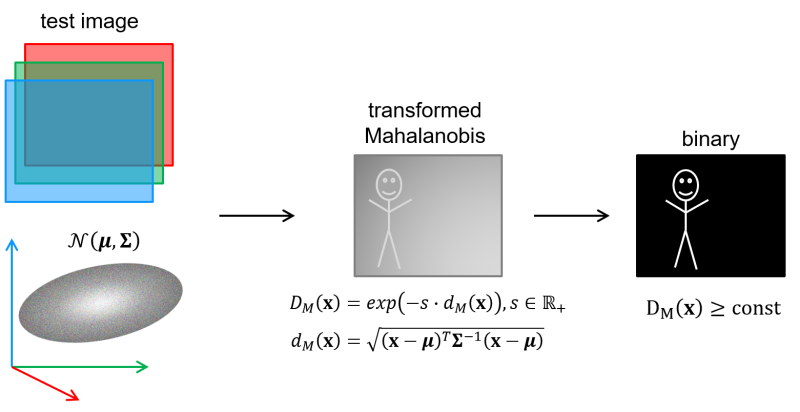
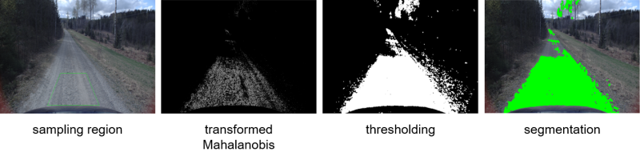

# Step 1: Get an overview
Today we will implement and experiment with a simple segmentation method based on color. You can choose to work on 
images from your camera or on the provided videos captured from an autonomous vehicle.

The idea is that each pixel corresponds to a 3-dimensional feature vector [R,G,B] (or [B,G,R] in OpenCV).
Pixels with similar colors should be in the same region of the 3-dimensional feature space.
If we know what kind of pixels we are looking for, we can represent them using a multivariate normal distribution.
We can then use the Mahalanobis distance to determine how well a pixel fit with the distribution.
Doing so for all pixels in an image gives us an image of Mahalanobis distances between the pixels and the distribution.

By thresholding the Mahalanobis distance image we get a binary image indicating the pixels that are closer than
the chosen threshold.

As we will experience, this simplistic approach is far from perfect. But the method can naturally be generalized and 
improved:

- Each pixel can be represented by more features than just color, thus increasing the dimension of the feature space.
- The group of pixels that we want to segment out might not fit well with a multivariate normal distribution, so we can
 use a more flexible distribution instead.

## Lab overview

The main steps in today's lab are:

- **Estimate a multivariate normal distribution** based on the pixels in a predefined sample region of a single image.

  

- For the following images, **create a Mahalanobis image** by computing the Mahalanobis distance between each pixel 
and the multivariate normal distribution. Transform the Mahalanobis image to get an image in the [0,1] range.

- **Create a binary image** by thresholding the transformed Mahalanobis image manually or by using Otsu's method.
The final binary image is the result of our segmentation method and we can use it to highlight the corresponding pixels
in the original image. If the result is noisy, we can clean up this binary image using morphological operations.

  
 
 - We will also implement a way to gradually update the multivariate normal distribution based on how the pixels in the
 sampling region change over time. 
 
 Finally we will use our segmentation method to perform road segmentation in videos captured from an autonomous 
 vehicle.
 
   

## Introduction to the project source files
We have chosen to distribute the code on the following files:
- _main.cpp_

  Handles the reading of images, the visualization of the segmentation and the manual thresholding of the transformed
  Mahalanobis image. Note in particular that:
    - Keypress `space` samples pixels from the sampling region and estimates the multivariate normal model
    - Keypress `o` turns thresholding by Otsu's method on/off (Default is off)
    - Keypress `a` turns the adaptive model on/off (Default is off)
  
  If you want to work on images from one of the videos instead of from the camera, you can change to code from 
  `cv::VideoCapture cap{0}` to `cv::VideoCapture cap{"your_video_path.avi"}`.

- _multivariate_normal_model.h, multivariate_normal_model.cpp_

  Contains the definition of the class `MultivariateNormalModel`.
  
  You will implement several methods in this class.
  
  
  Please continue to the [next step](2-finish-multivariate-normal-model.md).