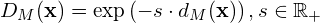
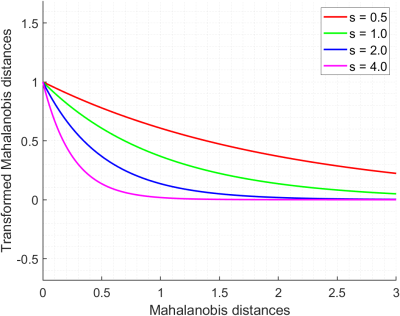

# Step 2: Finish `MultivariateNormalModel`
First, take a look at the definition and documentation in [multivariate_normal_model.h](../multivariate_normal_model.h).
Then go to [multivariate_normal_model.cpp](../multivariate_normal_model.cpp).
Read through the code to get an overview of the class.

## 1. Implement the method `performTraining()` in `MultivariateNormalModel`
The multivariate normal distribution for a dataset of vectors **x** is characterized by a mean vector **&mu;** and a covariance 
matrix **&Sigma;**.

![\mathcal{N}(\boldsymbol{\mu}, \boldsymbol{\Sigma}) = 
\frac{1}{ (2\pi)^{\frac{k}{2}} \left|\boldsymbol{\Sigma}\right|^{\frac{1}{2}}}
\exp\left[-\textstyle\frac{1}{2}(\boldsymbol{\mu} - \mathbf{x})^{T}\boldsymbol{\Sigma}^{-1}
(\boldsymbol{\mu} - \mathbf{x}) \right]](img/multivariate_normal_distribution.png)

Given such a distribution, the Mahalanobis distance between a vector **x** and the distribution is a measure for how 
well the vector fits with the distribution.

The method `MultivariateNormalModel::performTraining` should estimate the mean `mu_` and inverse covariance 
matrix `inv_covar_` for the model based on the training samples `samples_` collected from the  sampling region.

Take a look at [cv::calcCovarMatrix](https://docs.opencv.org/4.0.1/d2/de8/group__core__array.html#ga017122d912af19d7d0d2cccc2d63819f).
We want `mu_` to be a column vector. The [cv::CovarFlags](https://docs.opencv.org/4.0.1/d0/de1/group__core.html#ga719ebd4a73f30f4fab258ab7616d0f0f) in `cv::calcCovarMatrix()` can be combined like this: `flag1|flag2`.
See also [cv::invert](https://docs.opencv.org/4.0.1/d2/de8/group__core__array.html#gad278044679d4ecf20f7622cc151aaaa2).

In its current state, the method simply returns **`mu_` = [127; 127; 127]** and **`inv_covar_` = Identity**.
You should replace this with the correct computations.
 
## 2. Implement the method `computeMahalanobisDistances` in `MultivariateNormalModel`
This method should compute the Mahalanobis distance between every pixel in the input image and the estimated multivariate
normal model described by `mu_` and `sigma_inv_`.

The method should return a cv::Mat of Mahalanobis distances, but in its current state it simply returns a matrix of 0.5's.
You should replace this with a proper implementation.

Take a look at [cv::Mahalanobis](https://docs.opencv.org/4.0.1/d2/de8/group__core__array.html#ga4493aee129179459cbfc6064f051aa7d).

## 3. Implement the method `computeTransformedMahalanobisImage` in `MultivariateNormalModel`
Although we could perform segmentation based on the Mahalanobis distances directly, we would like to transform it into 
the range [0,1] which is better suited for visualization.

One way of doing this is to transform the image like this:

This transformation ensures that we get values in the range of [0,1] which is what we want.
It also flips the ordering such that low Mahalanobis distances ends up in the vicinity of 1, while large Mahalanobis 
distances ends up closer to 0.
Hence, the pixels that fit well with the distribution will be bright in our visualization while those that clearly do not 
fit will be dark.
The thresholding will segment out the pixels corresponding to the brightest pixels in our transformed Mahalanobis image.

The positive constant **s** in the transformation, can be chosen according to how we want the contrast to behave.

We suggest that you set *s = 2* to enhance the contrast in the lower range of Mahalanobis distances.
But feel free to test other values of **s** to get a transformed Mahalanobis image that works well for your setup.

In its current version, this method simply returns a matrix of 1's.
You should replace this with the matrix of properly transformed Mahalanobis distances.

Take a look at [cv::exp()](https://docs.opencv.org/4.0.1/d2/de8/group__core__array.html#ga3e10108e2162c338f1b848af619f39e5).

## 4. Implement the method `update`  in `MultivariateNormalModel`
This method should update the multivariate normal model by replacing a fraction of the existing `samples_` with some 
`new_samples` and then retrain the model.

This should make the model gradually change over time and we should be able to control the rate of which it changes by 
adjusting the `update_ratio`.

The `update_ratio` should be a number between 0 and 1, where 0.1 means that a random 10% of `samples_` are being replaced
with new one each iteration.

Keypress **a** activates/deactivates the adaptive model.

In its current state, this method does not perform any update at all.
Your job is to implement this method so that i works as intended.

**Suggestion 1:**  You can for instance use [cv::randu]() to generate a matrix of random numbers between 0 and 1 with the
same number of columns as `samples_`. Loop through the columns and replace columns if their random number is smaller than
the `update_ratio`.

**Suggestion 2:** Another approach is to make use of [cv::randShuffle](). By first shuffling both `samples_` and `new_samples` you
can update the first N columns of `samples_` with the first N columns of `new_samples`. Here N should be determined based
on the `update_ratio`.

How does this adaptive model work? Try adjusting the `update_ratio`. Are the changes noticeable?

Please continue to the [next step](3-further-work.md).